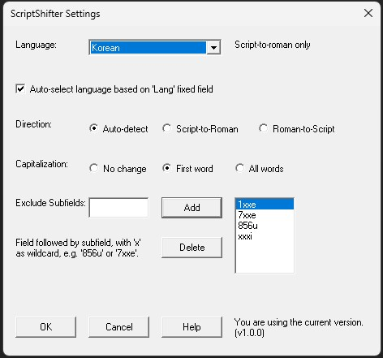

# ScriptShifter Macro for OCLC Connexion

This OCLC Connexion macro usese the Library of Congress "ScriptShifter" service (https://bibframe.org/scriptshifter) to convert between scripts and create parallel fields in WorldCat records.  The installer can be downloaded here:

<a href="https://github.com/pulibrary/oclcscriptshifter/releases/latest/download/InstallOCLCScriptShifter.exe">InstallOCLCScriptShifter.exe</a>

(Note: Depending on your computer's security settings, trying to run the installer may pop up a warning that "Windows protected Your PC". If you receive this warning, you can proceed with the installation by clicking "More info" and then "Run anyway".)

Alternatively, you can download this MBK file to your macros directory (e.g. `C:\Users\[your user id]\AppData\Roaming\OCLC\Connex\Macros\`).

<a href="https://github.com/pulibrary/oclcscriptshifter/releases/latest/download/ScriptShifter.mbk">ScriptShifter.mbk</a>

This macro can be used for any script supported by ScriptShifter.  However, as shown below, there are some special customizations for Korean.

## Configuration

The macro book contains 3 macros:
- ScriptShifter!Convert: Convert script and create parallel field
- ScriptShifter!Settings: Open settings dialog
- ScriptShifter!KoreanName: Re-convert Korean script using special setting for names

The following can be done for any or all of these macros:

**To add a macro to the toolbar**
- Select "Tools > User Tools > Assign...". At the top of the screen, click "Macros". In the list box on the left side of the window, select the desired macro.
- Under the "Select New User Tool" menu, select a tool that is not yet assigned to another function. Make note of the tool number, then click "Assign Tool", and then "OK".
- Select "Tools > Toolbar Editor...". Scroll down to "ToolsUserToolsX", where X is the tool number that you just assigned to the macro. Drag the icon to the desired location on the toolbar.
  
**To assign a keyboard shortcut**
- Select "Tools > Keymaps...". In the "Select Commands for Category" box at the top of the window, select "Macros". Double-click "ScriptShifter", then click the desired macro.
- Click in "Press New Shortcut Key" and press the keyboard shortcut you would like to assign to this macro.
- Make sure that "Shortcut Key Assigned to:" is blank, then click "Assign" and then "OK".

## Settings

This settings panel will appear the first time you run the "Convert" macro.  (You can bring it back up by running the "Settings" macro.)  If you already have a record open in Connexion, the language will be auto-detected from the 008 field, but you can select a different language in the "Language" menu (and turn off auto-selection if desired).  Be sure to confirm the direction of the conversion and the capitalization settings as well.  (Setting the direction to "auto-detect" will attempt a roman-to-script conversion if a given subfield only contains characters below U+0370 or between U+FE20 and U+FE2F, or script-to-roman otherwise.)  You do not need to re-open the settings panel each time you perform a conversion, unless you want to change these defaults.  

The "Exclude subfields" section allows you to specify that certain subfields should always be excluded from conversion.  Subfields can be indicated with the three-digit tag number followed by the subfield code, with 'x' as the wildcard.  So, in the example above, subfield 'e' of any 1xx or 7xx field will be excluded, as well as 856u and subfield 'i' of any field.  Subfields with numeric codes (0, 2, 6, etc.) are always excluded from conversion.  Entries can be added to this list by typing in the field to the left and clicking "Add".  An entry can be removed from the list by selecting it and clicking "Delete".

**NOTE**: There is a known bug in OCLC Connexion in which macro dialog boxes may not appear in front of the Connexion window.  If you try to open the settings panel (which will open automatically the first time you run the macro), it may appear that nothing happens.  If this is the case, check the Windows task bar for a flashing icon.  Clicking it should bring up the settings dialog.

## Running the 'Convert' macro

Simply place the cursor in the field you would like to convert, then run the 'Convert' macro.  A parallel field will be created with the converted text. (The fields will be reordered if needed so that the non-roman field appears before the romanized one.) Note that if the field being converted is a controlled heading, it will be temporarily uncontrolled while the converstion is being performed, then re-controlled afterwards.  If the field was partially controlled, Connexion will pop up a dialog asking whether a fully or partially controlled heading should be used.

If a field contains text that you do not wish to convert, simply highlight the text before running the macro, and the text will be passed through to the output unchanged. If there are certain specific subfields that you always want to exclude from conversion, these can be specified in the settings panel (see the previous section for details).  These subfields will be exlcuded even if they are not highlighted.

## Korean name conversion

ScriptShifter has a special setting for Korean names.  This is automatically used for fields 100, 600, 700, and 800.  For other fields, you can apply name formatting by highlighting the text in the original Korean script field, then running the 'KoreanName' macro.  This will reconvert the highlighted text using the Korean Name setting, and replace the romanized text in the parallel field.

## Acknowledgments

Many thanks to those who helped with testing this plugin in various languages: Alim Alp, Flora Kim, Hyoungbae Lee, and Yang Wang, as well as Stefano Cossu, Jessalyn Zoom, and the team at the Library of Congress that has made this collaboration possible.
