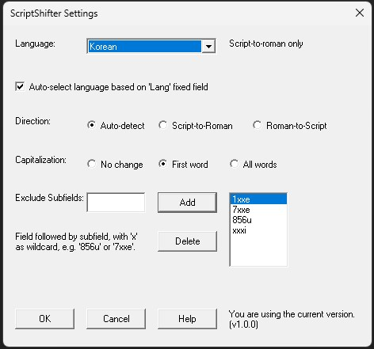

# ScriptShifter Macro for OCLC Connexion Client

This OCLC Connexion macro uses the Library of Congress [ScriptShifter](https://bibframe.org/scriptshifter) service to convert between scripts and create parallel fields in WorldCat bibliographic records.  (A full list of supported languages can be found [here](https://github.com/lcnetdev/scriptshifter/blob/main/doc/supported_scripts.md).)  The installer can be downloaded from the folliwing link: 

<a href="https://github.com/pulibrary/oclcscriptshifter/releases/latest/download/InstallOCLCScriptShifter.exe">InstallOCLCScriptShifter.exe</a>

(Note: Depending on your computer's security settings, trying to run the installer may pop up a warning that "Windows protected Your PC". If you receive this warning, you can proceed with the installation by clicking "More info" and then "Run anyway".)

Alternatively, you can download this macro book file to your macros directory (e.g. `C:\Users\[your user id]\AppData\Roaming\OCLC\Connex\Macros\`).  Users of Connexion v2.63 may need to download the macro file to `C:\Program Files (x86)\OCLC\Connexion\Program\Macros` and be given full permissions to this directory.

<a href="https://github.com/pulibrary/oclcscriptshifter/releases/latest/download/ScriptShifter.mbk">ScriptShifter.mbk</a>

This macro can be used for any script supported by ScriptShifter.  However, as shown below, there are some special customizations for Korean and Chinese.

## Configuration

The macro book contains 3 macros:
- ScriptShifter!Convert: Convert script and create parallel field
- ScriptShifter!Settings: Open settings dialog
- ScriptShifter!KoreanName: Re-convert Korean script using special setting for names

The following can be done for any or all of these macros:

**To add a macro to the toolbar**
- Select "Tools > User Tools > Assign...". At the top of the screen, click "Macros". In the list box on the left side of the window, select the desired macro.
- Under the "Select New User Tool" menu, select a tool that is not yet assigned to another function. Make note of the tool number, then click "Assign Tool", and then "OK".
- At this point, you can run the macro from the "User Tools" menu.  However, if you would also like to create a toolbar button:
  - Select "Tools > Toolbar Editor...". Scroll down to "ToolsUserToolsX", where X is the tool number that you just assigned to the macro. Drag the icon to the desired location on the toolbar.
  
**To assign a keyboard shortcut**
- Select "Tools > Keymaps...". In the "Select Commands for Category" box at the top of the window, select "Macros". Double-click "ScriptShifter", then click the desired macro.
- Click in "Press New Shortcut Key" and press the keyboard shortcut you would like to assign to this macro.
- Make sure that "Shortcut Key Assigned to:" is blank, then click "Assign" and then "OK".

(Note: There is another macro called "ScriptShifter!UtilityFunctions" that contains common code referenced by the other macros.  However, this is not meant to be run directly, and so should not be mapped to a User Tool or keyboard shortcut.)

## Settings

This settings panel will appear the first time you run the "Convert" macro.  (You can bring it back up by running the "Settings" macro.)  If you already have a record open in Connexion, the language will be auto-detected from the "Lang" fixed field (i.e. field 008), but you can select a different language in the "Language" menu (and turn off auto-selection if desired).  Be sure to confirm the direction of the conversion and the capitalization settings.  (Setting the direction to "auto-detect" will attempt a roman-to-script conversion if a given subfield contains only Latin characters, or script-to-roman otherwise.)  You do not need to re-open the settings panel each time you perform a conversion, unless you want to change these defaults.  

The "Exclude subfields" section allows you to specify that certain subfields always be excluded from conversion.  Subfields can be indicated with the three-digit tag number followed by the subfield code, with 'x' as the wildcard.  So, in the example above, subfield 'e' of any 1xx or 7xx field will be excluded, as well as 490v, 856u, and subfield 'i' of any field.  Subfields with numeric codes (0, 2, 6, etc.) are always excluded from conversion.  Entries can be added to this list by typing in the field to the left and clicking "Add".  An entry can be removed from the list by selecting it and clicking "Delete".

## Running the 'Convert' macro

Simply place the cursor in the field you would like to convert, then run the 'Convert' macro.  A parallel field will be created with the converted text. (The fields will be reordered if needed so that the non-roman field appears before the romanized one.)

If part of a field contains text that you do not wish to convert, simply highlight that text before running the macro, and that portion of the field will be passed through to the output unchanged. If there are certain specific subfields that you always want to exclude from conversion, these can be specified in the settings panel (see the previous section for details).  These subfields will be exlcuded even if they are not highlighted.

## Korean name conversion

ScriptShifter has a special setting for Korean names. The 'Convert' macro will automatically use this setting for fields 100a, 600a, 700a, and 800a.  For other fields (such as 245c), formatting Korean names is a two-step process. First, convert the entire field using the 'Convert' macro as you normally would.  This will generate the parallel romanized field.  Second, highlight the Korean name(s) in the non-Roman field, then run the 'KoreanName' macro.  This will reconvert the highlighted text using the Korean name setting, replacing the romanized text in the parallel field.

## Chinese name/number customizations

Chinese pinyin text found in 100a, 600a, 700a, and 800a will be formatted as a personal name (e.g. "温道明" -> "Wen, Daoming").  To format text in other fields as personal or proper names, see the <a href="https://github.com/pulibrary/oclcpinyin?tab=readme-ov-file#extra-macros-for-manual-adjustments">PinyinExtras</a> macro book.  These macros should be run after "ScriptShifter!Convert".  

By default, ScriptShifter converts Chinese numerals to pinyin (e.g. "一百二十三" -> "yi bai er shi san"), but the "ConvertNumbers" macro in "PinyinExtras" can be run afterwards to convert the pinyin numbers to Arabic numerals, if desired (e.g. "yi bai er shi san" -> "123").

## Known issues
- If the field being converted is a controlled heading, it will be temporarily uncontrolled while the conversion is being performed, then re-controlled afterwards.  If the field was partially controlled, Connexion will pop up a dialog asking whether a fully or partially controlled heading should be used.
- There is a known bug in OCLC Connexion in which macro dialog boxes may not appear in front of the Connexion window.  If you try to open the settings panel (which will open automatically the first time you run the macro), it may appear that nothing happens.  If this is the case, check the Windows task bar for a flashing icon.  Clicking it should bring up the settings dialog.
- If you receive an error that the macro cannot be loaded, check that the settings dialog is not still open.  (It is easy to lose it behind other windows, but if it is open, it may prevent other macros from running.)
- Even if the capitalization setting is set to "first word" or "all words", words may not be capitalized if they are directly preceded by a punctuation mark (like a parenthesis, bracket, or quotation mark).

## Reporting Bugs and Making Suggestions

If you notice any inaccuracies in the output, first check if the ScriptShifter website itself (https://bibframe.org/scriptshifter/) generates the same results.  If so, click the "Suggest Improvement" button, which will allow you to fill out a form to suggest a better transliteration. (This form will be submitted to the ScriptShifter developers at the Library of Congress.) To report bugs or make suggestions about the OCLC Connexion macro, use the "Issues" tab at the top of this page.

## Acknowledgments

Many thanks to those who helped with testing this plugin in various languages: Alim Alp, Minyoung Chung, Flora Kim, Seong Heon Lee, Hyoungbae Lee, Michael Meerson, Charles Riley, and Yang Wang, as well as Stefano Cossu, Jenna Moon, Jessalyn Zoom, and the team at the Library of Congress that has made this collaboration possible.
