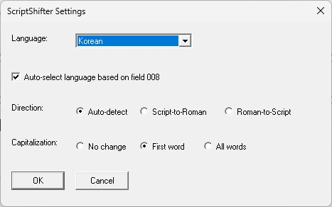

# ScriptShifter Macro for OCLC Connexion

This OCLC Connexion macro usese the Library of Congress "ScriptShifter" service (https://bibframe.org/scriptshifter) to convert between scripts and create parallel fields in WorldCat records.  The installer can be downloaded here:

<a href="https://github.com/pulibrary/oclcscriptshifter/releases/latest/download/InstallOCLCScriptShifter.exe">InstallOCLCScriptShifter.exe</a>

This macro can be used for any script supported by ScriptShifter.  However, as shown below, there are some special customizations for Korean.

## Configuration

The macro book contains 3 macros:
- ScriptShifter!Convert: Convert script and create parallel field
- ScriptShifter!Settings: Open settings dialog
- ScriptShifter!KoreanName: Re-convert Korean script using special setting for names

The following can be done for any or all of these macros:

**To add a macros to the toolbar**
- Select "Tools > User Tools > Assign...". At the top of the screen, click "Macros". In the list box on the left side of the window, select the desired macro.
- Under the "Select New User Tool" menu, select a tool that is not yet assigned to another function. Make note of the tool number, then click "Assign Tool", and then "OK".
- Select "Tools > Toolbar Editor...". Scroll down to "ToolsUserToolsX", where X is the tool number that you just assigned to the macro. Drag the icon to the desired location on the toolbar.
  
**To assign a keyboard shortcut**
- Select "Tools > Keymaps...". In the "Select Commands for Category" box at the top of the window, select "Macros". Double-click "ScriptShifter", then click the desired macro.
- Click in "Press New Shortcut Key" and press the keyboard shortcut you would like to assign to this macro.
- Make sure that "Shortcut Key Assigned to:" is blank, then click "Assign" and then "OK".

## Settings

This settings panel will appear the first time you run the "Convert" macro.  (You can bring it back up by running the "Settings" macro).  If you already have a record open in Connexion, the language will be auto-detected from the 008 field, but you can select a different language in the language menu (and turn off auto-selection if desired).  Be sure to confirm the direction of the conversion (Script-to-Roman or Roman-to-Script) and the capitalization settings as well.  You do not need to re-open the settings panel each time you perform a conversion, unless you want to change these defaults.  (Note: If you try to run the "Settings" menu and nothing comes up, look for a flashing icon in your taskbacr and click that.)

**NOTE**: There is a known bug in OCLC Connexion in which macro dialog boxes may not appear in front of the Connexion window.  If you try to open the settings panel (which will open automatically the first time you run the macro), it may appear that nothing happens.  If this is the case, check the Windows task bar for a flashing icon.  Clicking it should bring up the settings dialog.

## Running the 'Convert' macro

Simply place the cursor in the field you would like to convert, then run the 'Convert' macro.  A parallel field will be created below the current field with the converted text.

## Korean name conversion

ScriptShifter has a special setting for Korean names.  This is automatically used for fields 100, 600, 700, and 800.  For other fields, you can apply name formatting by highlighting the text in the original Korean script field, then running the 'KoreanName' macro.  This will reconvert the highlighted text using the Korean Name setting, and replace the romanized text in the parallel field.
